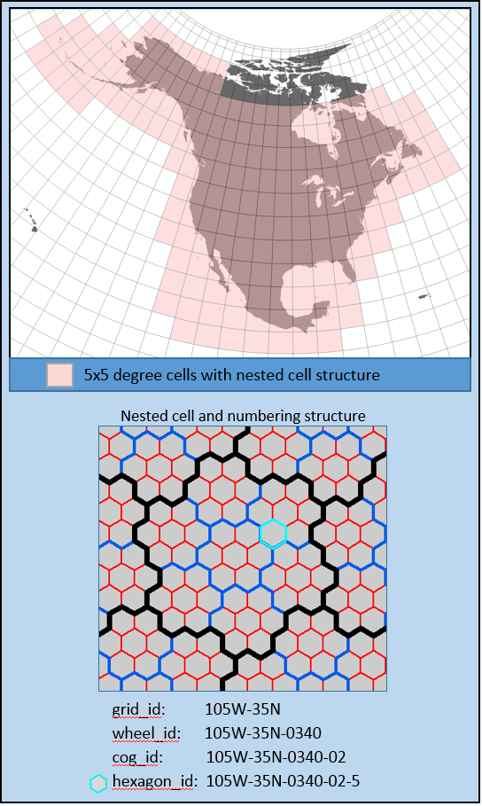
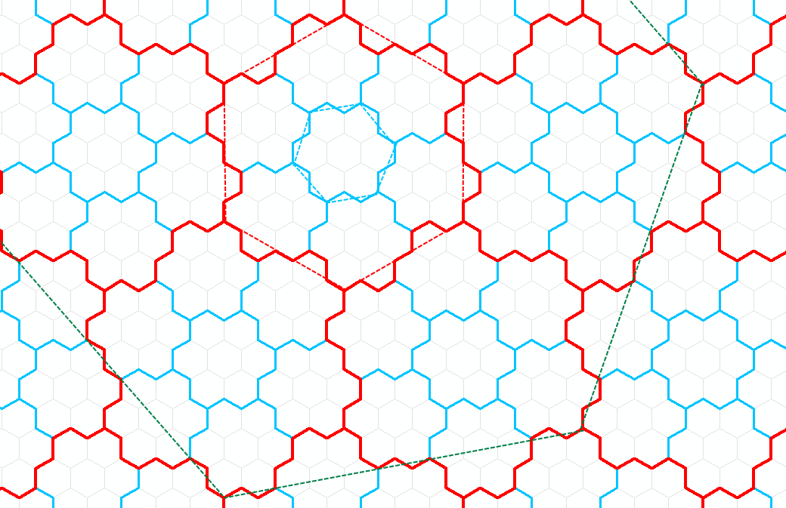

The Nested Hexagon Framework was created by the [University of Kansas](http://kars.ku.edu/) and used within the [Western Association of Fish & Wildlife Agencies Crucial Assessment Tool](https://www.wafwachat.org/).

# Overview #

Its foundation is a well-defined hexagon grid which covers most of North America. Each hex covers 1 square mile. Hexes are grouped into cogs, where a cog consists of a central hex plus each adjacent hex, for a total of seven hexes per cog (7 sq miles). Cogs are similarly grouped into wheels, where each wheel consists of a central cog and its six adjacent cogs (49 sq miles). The framework divides its coverage area into 5x5 degree tiles, such that each wheel is fully contained within a single tile. (Technically, the tile boundaries aren’t quite rectangular, since they follow the wheel boundaries, which in turn follow the cog and hex boundaries.)

NatureServe has extended the Nested Hexagon Framework’s (NHF) coverage area to also include Northern Canada, Hawaii, and the Caribbean.

NatureServe has also created broader aggregations of hexagons:

- Level 1 Summary Hex Aggregations consist a central NHF wheel and all six adjacent wheels. It includes a total of 343 one-square mile hexagons.
- Level 2 Summary Hex Aggregations consist of a central Level 1 Summary Hex Aggregation and all six adjacent Level 1 Summary Hex Aggregations. It includes a total of 2,401 one-square mile hexagons.
- Level 3 Summary Hex Aggregations consist of a central Level 2 Summary Hex Aggregation and all six adjacent Level 2 Summary Hex Aggregations. It includes a total of 16,807 one-square mile hexagons

Technically, the exact boundaries of a Level 1, 2, or 3 Summary Hex Aggregation would be very jagged. However, because these features are intended to be viewed at broad geographic scales where the exact borders would be nearly indiscernable, they are shown on NatureServe Explorer as "approximate hexagons". In the diagram below, the green outline shows how an Approximate Level 1 Summary Hexagon is generated from the NHF wheels (outlined in red) which comprise the feature.

# Downloading #

The original nested hexagon framework can be downloaded from the [Western Association of Fish & Wildlife Agencies Crucial Assessment Tool](https://www.wafwachat.org/) data portal.

The extended version of the framework can be downloaded through the [Releases](https://github.com/NatureServe/nested-hexagon-framework/releases) section of this Github site.

nested_hexagon_framework_1sqm.gdb.zip contains a file geodatabase with the following layers:

- nhf_hexes - the hexagon features from the original nested hexagon framework
- nhf_cogs - the cog features from the original nested hexagon framework
- nhf_wheels - the wheel features from the original nested hexagon framework
- nhf_wheels_smoothed - approximate hexagons for the wheel features from the original nested hexagon framework
- nhf_hexes_na - NatureServe's North American extensions to the hexagon features
- nhf_cogs_na - NatureServe's North American extensions to the cog features
- nhf_wheels_na - NatureServe's North American extensions to the wheel features
- nhf_wheels_smoothed_na - approximate hexagons for NatureServe's North American extensions to the wheel features
- nhf_summary_hexes_l1 - approximate hexagons for the Level 1 Summary Hex Aggregations 
- nhf_summary_hexes_l2 - approximate hexagons for the Level 2 Summary Hex Aggregations
- nhf_summary_hexes_l3 - approximate hexagons for the Level 3 Summary Hex Aggregations
- grid_5deg_nhf_coverage - this shows the 5 degree grid zones covered by the original framework, those covered by NatureServe's extensions, and those which are not covered by either.
- nhf_summary_hexes_l1_actual - The unioned geometries of the nhf_wheels layer grouped by the nhf_summary_hexes_l1_id. This is considered the "actual shape" of the nhf_summary_hexes_l1 geometries.

NHF_Extensions.mxd can be used to visualize the geodatabase layers.

NHF_Extensions_wm.mxd is the same map, but projected to web mercator. It is intended to give an idea of how data will look through a web map.

# License #

This work is licensed under a [Creative Commons Attribution-NonCommercial-ShareAlike 4.0 International License](https://creativecommons.org/licenses/by-nc-sa/4.0/).

